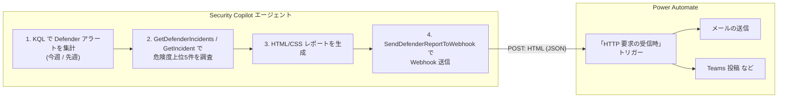

# Power Automate 連携セットアップ手順

週次 Defender インシデントレポート **HTML / Webhook 送信版**
（[WeeklyDefenderIncidentReport_html_webhook.yaml](WeeklyDefenderIncidentReport_html_webhook.yaml)）を、
Power Automate の **Incoming Webhook**（「HTTP 要求の受信時」トリガー）と連携させる手順です。

エージェントが生成した HTML/CSS レポートを API プラグイン経由で Power Automate へ POST し、
Power Automate 側でメール送信・Teams 投稿・SharePoint 保存などの後続処理を行います。



---

## ステップ 1: Power Automate フローを作成

1. Power Automate で「**HTTP 要求の受信時 (When a HTTP request is received)**」トリガーの
   フローを新規作成します。
2. 「**要求本文の JSON スキーマ**」に以下を設定します（任意項目を含む）:

   ```json
   {
     "type": "object",
     "properties": {
       "reportTitle": { "type": "string" },
       "summary":     { "type": "string" },
       "htmlBody":    { "type": "string" },
       "generatedAt": { "type": "string" }
     }
   }
   ```

3. 後続アクション（例: 「**メールの送信 (V2)**」）を追加し、本文に動的コンテンツ
   `htmlBody`、件名に `reportTitle` を割り当てます。「メールの送信」の本文は
   **HTML として扱う**設定にしてください。
4. フローを**保存**すると、トリガーに HTTP POST URL が生成されます。

---

## ステップ 2: Webhook URL の各要素を OpenAPI に反映

生成された URL は次の形式です:

```
https://<host>.logic.azure.com/workflows/<workflowId>/triggers/manual/paths/invoke
  ?api-version=2016-06-01&sp=%2Ftriggers%2Fmanual%2Frun&sv=1.0&sig=<署名>
```

[WeeklyDefenderIncidentReport_webhook_openapi.yaml](WeeklyDefenderIncidentReport_webhook_openapi.yaml)
を編集します:

| 置き換え対象 | 設定する値 |
|---|---|
| `servers[].url` の `YOUR-LOGIC-APP-HOST.logic.azure.com` | 自分の `<host>.logic.azure.com` |
| `paths` キーの `YOUR-WORKFLOW-ID` | 自分の `<workflowId>` |

> `api-version` / `sp` / `sv` は固定値のため OpenAPI 内に既定値として定義済みです。
> **署名 `sig` は OpenAPI に書きません**（シークレットをモデルに露出させないため。ステップ 4 で設定）。

---

## ステップ 3: OpenAPI 仕様を公開ホスト

編集した OpenAPI 仕様を **公開 URL**（GitHub Gist / raw.githubusercontent.com など）で
ホストし、その URL を
[WeeklyDefenderIncidentReport_html_webhook.yaml](WeeklyDefenderIncidentReport_html_webhook.yaml)
の `OpenApiSpecUrl` に設定します。

```yaml
SkillGroups:
  - Format: API
    Settings:
      OpenApiSpecUrl: https://raw.githubusercontent.com/<自分のリポジトリ>/WeeklyDefenderIncidentReport_webhook_openapi.yaml
```

---

## ステップ 4: エージェントをアップロードし、署名を設定

1. Security Copilot にエージェントマニフェスト
   [WeeklyDefenderIncidentReport_html_webhook.yaml](WeeklyDefenderIncidentReport_html_webhook.yaml)
   をアップロードします。
2. **Custom** プラグインのセットアップで、**ApiKey** の値として Webhook URL の
   `sig=` 以降の**署名文字列**を入力します。
   - マニフェストの `Authorization.Key: sig` / `Location: QueryParams` により、
     リクエスト時に `&sig=<署名>` として自動付与されます。

---

## ステップ 5: 実行

- `WeeklySchedule` トリガー（`DefaultPollPeriodSeconds: 604800` = 7日）で週次自動実行されます。
- 手動実行や、Power Automate からのトリガーで任意のタイミングでも実行できます。

---

## 認証についての補足

- **API スキルグループ**（Webhook 送信）の認証は Descriptor の `SupportedAuthTypes: ApiKey`
  / `Authorization` に従い、署名 `sig` をクエリパラメータとして付与します。
- **KQL / Agent スキルグループ**は Microsoft の委任認証（オンビハーフ）を使用するため、
  上記 ApiKey 設定の影響を受けません（混在フォーマットプラグインの仕様）。

---

## 既知の注意事項

- Security Copilot の公式ドキュメントでは、API プラグインの POST は本来「データ取得用途」
  とされています（[API plugins / Limitations](https://learn.microsoft.com/copilot/security/plugin-api#limitations)）。
  Power Automate Webhook への送信は POST レスポンス（200/202）を受け取る形で動作しますが、
  環境によって挙動が異なる可能性があります。送信が安定しない場合は、Logic App プラグイン
  （[LOGICAPP_PLUGINS.md](../../references/LOGICAPP_PLUGINS.md)）を用いた送信方式も検討してください。
- Webhook URL の署名 `sig` はシークレットです。OpenAPI 仕様やマニフェストに直接書き込まず、
  必ずプラグインの ApiKey 設定として入力してください。
