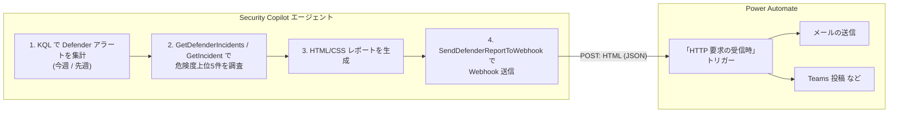

# Power Automate 連携セットアップ手順

週次 Defender インシデントレポート **HTML / Webhook 送信版**
（[WeeklyDefenderIncidentReport_html_webhook.yaml](WeeklyDefenderIncidentReport_html_webhook.yaml)）を、
Power Automate の **Incoming Webhook**（「HTTP 要求の受信時」トリガー）と連携させる手順です。

エージェントが生成した HTML/CSS レポートを API プラグイン経由で Power Automate へ POST し、
Power Automate 側でメール送信・Teams 投稿・SharePoint 保存などの後続処理を行います。



---

## ステップ 1: Power Automate フローを作成

### 1-1. フローの新規作成

1. [Power Automate](https://make.powerautomate.com/) にサインインします。
2. 左メニューの「**マイ フロー (My flows)**」→「**新しいフロー (New flow)**」→
   「**インスタント クラウド フロー (Instant cloud flow)**」を選択します。
3. フロー名（例: `Defender週次レポート受信`）を入力します。
4. トリガーの選択画面で「**HTTP 要求の受信時 (When a HTTP request is received)**」を検索して選択し、
   「**作成 (Create)**」をクリックします。

> 「HTTP 要求の受信時」トリガーはプレミアムコネクタです。利用には Power Automate の
> プレミアムライセンスが必要な場合があります。

### 1-2. 要求本文の JSON スキーマを設定

1. 追加された「HTTP 要求の受信時」トリガーを展開します。
2. 「**要求本文の JSON スキーマ (Request Body JSON Schema)**」に以下を貼り付けます
   （`htmlBody` を含む 4 プロパティ）:

   ```json
   {
     "type": "object",
     "properties": {
       "reportTitle": { "type": "string" },
       "summary":     { "type": "string" },
       "htmlBody":    { "type": "string" },
       "generatedAt": { "type": "string" }
     }
   }
   ```

   > 「**サンプルのペイロードを使用してスキーマを生成 (Use sample payload to generate schema)**」
   > を使う場合は、上記と同じプロパティを持つ JSON サンプルを貼り付けると自動生成できます。

3. （任意）トリガーの「**詳細設定 (Settings)**」で「**メソッド (Method)**」を `POST` に
   明示的に指定できます。Security Copilot からは POST で送信されます。

### 1-3. フローをトリガーできるユーザーを設定（ApiKey / sig 認証）

1. トリガーの「**フローをトリガーできるユーザー (Who can trigger the flow)**」を
   「**全員 (Anyone)**」に設定します。
2. これにより、生成される URL の末尾に **SAS 署名 `sig`** が付与され、その `sig` が
   呼び出しの資格情報として機能します。

> **【重要】なぜ「テナント内のユーザーのみ」(OAuth) が使えないか**
>
> Security Copilot エージェントは On-Behalf-Of (OBO) 認証で外部 API を呼び出しますが、
> Power Automate / Flow API（`service.flow.microsoft.com`）は Microsoft の
> ファーストパーティ API のため、Security Copilot アプリからの OBO トークン取得には
> API オーナー（Microsoft）側の事前承認(preauthorization)が必要です。これが無いため、
> 「テナント内のユーザーのみ」にすると実行時に **`AADSTS65002`** で失敗します。
> このため本構成では **「全員」＋ `sig`（ApiKey）方式**を使用します。
>
> - `sig` は URL に含まれるシークレットです。OpenAPI 仕様やマニフェストに直接
>   書き込まず、必ずプラグイン適用時に **ApiKey** として入力してください。
> - より厳密な認証が必要な場合は、API プラグインではなく **Logic App プラグイン**
>   （Azure RBAC で認証）への変更を検討してください（既知の注意事項を参照）。

### 1-4. 後続アクションを追加（メール送信の例）

1. トリガーの下の「**＋ 新しいステップ (New step)**」をクリックします。
2. 「**メールの送信 (V2)** (Office 365 Outlook)」を検索して追加します。
3. 各フィールドに動的コンテンツを割り当てます:

   | フィールド | 設定値 |
   |---|---|
   | **宛先 (To)** | レポートの送信先メールアドレス |
   | **件名 (Subject)** | 動的コンテンツ `reportTitle` |
   | **本文 (Body)** | 動的コンテンツ `htmlBody` |

4. 本文を HTML として扱うため、本文欄右上の **`</>`（コードビュー切替）**を有効にして
   `htmlBody` を挿入すると、HTML がそのままレンダリングされて送信されます。

> Teams へ投稿する場合は「**チャットまたはチャネルでメッセージを投稿する**」アクションを追加し、
> メッセージ本文に `htmlBody`（または `summary`）を割り当てます。
> SharePoint へ保存する場合は「**ファイルの作成**」アクションで `htmlBody` をファイル内容に
> 設定します。

### 1-5. （任意）応答を返す

Security Copilot 側で送信結果を確認したい場合は、フロー末尾に「**応答 (Response)**」アクションを
追加し、状態コード `200` を返すように設定します（既定では `202 Accepted` が返ります）。

### 1-6. フローを保存し URL を取得

1. 右上の「**保存 (Save)**」をクリックします。
2. 保存後、「HTTP 要求の受信時」トリガーに「**HTTP POST の URL**」が自動生成されます。
   この URL をコピーして、次のステップで使用します。

---

## ステップ 2: Webhook URL の各要素を OpenAPI に反映

「全員 (Anyone)」設定で生成された URL は新アーキテクチャ（Power Platform）形式で、
末尾に **`sp` / `sv` / `sig`** が付与されます:

```
https://<envId>.<region>.environment.api.powerplatform.com
  /powerautomate/automations/direct/workflows/<workflowId>/triggers/manual/paths/invoke
  ?api-version=1&sp=<...>&sv=<...>&sig=<署名>
```

[WeeklyDefenderIncidentReport_webhook_openapi.yaml](WeeklyDefenderIncidentReport_webhook_openapi.yaml)
を編集します:

| 置き換え対象 | 設定する値 |
|---|---|
| `servers[].url` のホスト | 自分の `https://<envId>.<region>.environment.api.powerplatform.com` |
| `paths` キーの `<workflowId>` | 自分のワークフロー ID |
| `sp` パラメータの `enum` / `default` | URL の `sp=` の値（例 `/triggers/manual/run`） |
| `sv` パラメータの `enum` / `default` | URL の `sv=` の値（例 `1.0`） |

> `api-version` / `sp` / `sv` はそれぞれ単一値の `enum` として OpenAPI に定義してあります。
> これによりエージェントが常に同じ固定値を送信します。
>
> **【重要】`sp` / `sv` / `api-version` の 3 つが揃わないと SAS 認証に失敗し 401 になります**。
> OpenAPI の `default` 値は「自動送信」されないため、マニフェストの指示文で
> エージェントに「これらを必ず明示的に指定する」よう指示しています（設定済み）。
> **`sig`（署名）は OpenAPI に書き込みません**。ステップ 4 でプラグインの ApiKey として
> 入力します。

---

## ステップ 3: OpenAPI 仕様を公開ホスト

編集した OpenAPI 仕様を **公開 URL**（GitHub Gist / raw.githubusercontent.com など）で
ホストし、その URL を
[WeeklyDefenderIncidentReport_html_webhook.yaml](WeeklyDefenderIncidentReport_html_webhook.yaml)
の `OpenApiSpecUrl` に設定します。

```yaml
SkillGroups:
  - Format: API
    Settings:
      OpenApiSpecUrl: https://raw.githubusercontent.com/<自分のリポジトリ>/WeeklyDefenderIncidentReport_webhook_openapi.yaml
```

---

## ステップ 4: エージェントをアップロードし、ApiKey（sig）を設定

本フローは「全員 (Anyone)」で公開され、URL 末尾の `sig`（SAS 署名）が資格情報です。
Security Copilot 側は **ApiKey** 認証で `sig` をクエリパラメータとして付与します。

1. Security Copilot にエージェントマニフェスト
   [WeeklyDefenderIncidentReport_html_webhook.yaml](WeeklyDefenderIncidentReport_html_webhook.yaml)
   をアップロードします。マニフェストには以下が定義済みです:

   ```yaml
   SupportedAuthTypes:
     - ApiKey
   Authorization:
     Type: APIKey
     Key: sig
     Location: QueryParams
     AuthScheme: ''
   ```

2. アップロード後、**Custom** プラグインのセットアップ画面で **API キー**の入力を求められます。
   ステップ 1-6 で取得した URL の **`sig=` 以降の値（署名文字列のみ）** を貼り付けます。
   Security Copilot が Webhook 呼び出し時に `&sig=<値>` をクエリに付与します。

> **【重要】OBO（AADDelegated）は使えません**: Power Automate / Flow API は Microsoft の
> ファーストパーティ API のため、Security Copilot アプリからの On-Behalf-Of トークン取得には
> 事前承認が必要で、実行時に `AADSTS65002` で失敗します。そのため ApiKey（sig）方式を使用します。

---

## ステップ 5: 実行

- `WeeklySchedule` トリガー（`DefaultPollPeriodSeconds: 604800` = 7日）で週次自動実行されます。
- 手動実行や、Power Automate からのトリガーで任意のタイミングでも実行できます。
- 実行後、エージェントが「週次 Defender インシデントレポートを Power Automate へ
  送信しました。」と出力し、Power Automate の**実行履歴**に新しい実行が
  記録されれば成功です。

---

## トラブルシューティング

| 症状 | 原因 | 対処 |
|---|---|---|
| **HTTP を生成しただけで送信されない** | エージェントが Webhook 送信（フェーズ4）を実行していない | 最新マニフェストを再アップロード（送信を必須ステップ化済み） |
| **401 Unauthorized（URL にクエリが付かない）** | `api-version` / `sp` / `sv` が送信されていない | OpenAPI で 3 パラメータを単一値 `enum` にし、マニフェストで明示送信を指示（設定済み） |
| **401 Unauthorized（`sig` 付きでも失敗）** | ApiKey に `sig` 未登録 / 値が不正 / 空白・改行混入 | プラグインの API キーに `sig=` 以降の値のみを再入力 |
| **403 Forbidden** | `sig` が失効 / トリガー URL 再生成済み | Power Automate で最新 URL を取得し、`sig` を更新 |
| **AADSTS65002** | `AADDelegated`（OBO）を使用している | 認証を ApiKey（sig）方式に変更（本手順どおり） |

> **検証コマンド（PowerShell）**: エージェントとは別に URL 単体の疎通を確認できます。
>
> ```powershell
> $url = "<sig まで含む完全な HTTP POST URL>"
> $body = '{"reportTitle":"テスト","summary":"疎通テスト","htmlBody":"<h1>接続テスト</h1>","generatedAt":"2026-06-15T00:00:00Z"}'
> Invoke-WebRequest -Uri $url -Method Post -ContentType "application/json; charset=utf-8" -Body ([System.Text.Encoding]::UTF8.GetBytes($body))
> ```
>
> `202 Accepted` が返れば URL ・`sig` は正常です（認証ヘッダー不要）。

---

## 認証についての補足

- **API スキルグループ**（Webhook 送信）の認証は Descriptor の
  `SupportedAuthTypes: ApiKey` / `Authorization`（`Key: sig`, `Location: QueryParams`）に従い、
  プラグイン適用時に入力した `sig`（SAS 署名）をクエリパラメータとして付与します。
- **KQL / Agent スキルグループ**は Microsoft の委任認証（オンビハルフ）を使用します。
  これらは Defender / Sentinel など Security Copilot が事前承認済みのリソースを呼び出すため、
  OBO が成立します（Power Automate は事前承認外のため ApiKey 方式が必要）。
- `sig` はシークレットです。漏洩時は Power Automate でトリガー URL を再生成し、
  プラグインの ApiKey を入れ直してください。

---

## 既知の注意事項

- Security Copilot の公式ドキュメントでは、API プラグインの POST は本来「データ取得用途」
  とされています（[API plugins / Limitations](https://learn.microsoft.com/copilot/security/plugin-api#limitations)）。
  Power Automate Webhook への送信は POST レスポンス（200/202）を受け取る形で動作しますが、
  環境によって挙動が異なる可能性があります。送信が安定しない場合は、Logic App プラグイン
  （[LOGICAPP_PLUGINS.md](../../references/LOGICAPP_PLUGINS.md)）を用いた送信方式も検討してください。
- **OAuth（AADDelegated）は Power Automate には使えません**。Flow API（`service.flow.microsoft.com`）は
  Microsoft のファーストパーティ API で、Security Copilot アプリからの OBO トークン取得には
  事前承認が必要なため、実行時に `AADSTS65002` で失敗します。本構成は「全員」＋ `sig`（ApiKey）で回避します。
- `sig` はシークレットです。OpenAPI 仕様やマニフェストに直接書き込まず、必ずプラグインの
  ApiKey 設定として入力してください。
- **`api-version` / `sp` / `sv` は必ず 3 つとも送信する必要があります**。OpenAPI の `default`
  値は自動送信されないため、本構成では 3 パラメータを単一値 `enum` で定義し、マニフェストの
  指示文でエージェントに「必ず明示的に指定する」よう求めています。いずれかが欠けると
  SAS 認証に失敗し 401 になります。
- より厳密な認証（Azure RBAC）が必要な場合は、API プラグインではなく **Logic App プラグイン**
  への変更を検討してください。
- 新アーキテクチャ（`*.environment.api.powerplatform.com`）の URL は 255 文字を超える場合が
  あります。中継システムを挟む場合は長い URL を許容できることを確認してください。