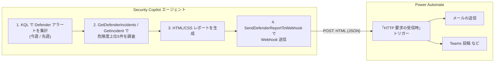

# Power Automate 連携セットアップ手順

週次 Defender インシデントレポート **HTML / Webhook 送信版**
（[WeeklyDefenderIncidentReport_html_webhook.yaml](WeeklyDefenderIncidentReport_html_webhook.yaml)）を、
Power Automate の **Incoming Webhook**（「HTTP 要求の受信時」トリガー）と連携させる手順です。

エージェントが生成した HTML/CSS レポートを API プラグイン経由で Power Automate へ POST し、
Power Automate 側でメール送信・Teams 投稿・SharePoint 保存などの後続処理を行います。



---

## ステップ 1: Power Automate フローを作成

### 1-1. フローの新規作成

1. [Power Automate](https://make.powerautomate.com/) にサインインします。
2. 左メニューの「**マイ フロー (My flows)**」→「**新しいフロー (New flow)**」→
   「**インスタント クラウド フロー (Instant cloud flow)**」を選択します。
3. フロー名（例: `Defender週次レポート受信`）を入力します。
4. トリガーの選択画面で「**HTTP 要求の受信時 (When a HTTP request is received)**」を検索して選択し、
   「**作成 (Create)**」をクリックします。

> 「HTTP 要求の受信時」トリガーはプレミアムコネクタです。利用には Power Automate の
> プレミアムライセンスが必要な場合があります。

### 1-2. 要求本文の JSON スキーマを設定

1. 追加された「HTTP 要求の受信時」トリガーを展開します。
2. 「**要求本文の JSON スキーマ (Request Body JSON Schema)**」に以下を貼り付けます
   （`htmlBody` を含む 4 プロパティ）:

   ```json
   {
     "type": "object",
     "properties": {
       "reportTitle": { "type": "string" },
       "summary":     { "type": "string" },
       "htmlBody":    { "type": "string" },
       "generatedAt": { "type": "string" }
     }
   }
   ```

   > 「**サンプルのペイロードを使用してスキーマを生成 (Use sample payload to generate schema)**」
   > を使う場合は、上記と同じプロパティを持つ JSON サンプルを貼り付けると自動生成できます。

3. （任意）トリガーの「**詳細設定 (Settings)**」で「**メソッド (Method)**」を `POST` に
   明示的に指定できます。Security Copilot からは POST で送信されます。

### 1-3. フローをトリガーできるユーザーを制限（OAuth 認証）

1. トリガーの「**フローをトリガーできるユーザー (Who can trigger the flow)**」を
   「**テナント内のユーザーのみ (Only users in my tenant)**」に設定します。
2. これにより、呼び出しには Microsoft Entra ID の OAuth トークンが必須となり、
   生成される URL には署名（sig）が含まれなくなります（`api-version=1` で終わる形式）。

> - 「**テナント内のユーザーのみ**」: **本番推奨**。呼び出し元は Entra ID で認証し、
>   有効な OAuth ベアラートークン（audience: `https://service.flow.microsoft.com/`）を
>   提示する必要があります。Security Copilot 側は AADDelegated でこれを満たします。
> - 「**特定のユーザーのみ**」: 上記に加え、許可ユーザーを限定できます。Security Copilot の
>   実行に使うユーザー（またはサービスプリンシパルのオブジェクト ID）を許可リストに追加します。
> - 「**全員 (Anyone)**」: レガシー設定。URL 自体が資格情報（sig 付き）として機能します。
>   この方式を使う場合のみ、マニフェストを ApiKey（`Key: sig`, `Location: QueryParams`）に
>   変更し、署名をプラグインの ApiKey として安全に入力してください。

### 1-4. 後続アクションを追加（メール送信の例）

1. トリガーの下の「**＋ 新しいステップ (New step)**」をクリックします。
2. 「**メールの送信 (V2)** (Office 365 Outlook)」を検索して追加します。
3. 各フィールドに動的コンテンツを割り当てます:

   | フィールド | 設定値 |
   |---|---|
   | **宛先 (To)** | レポートの送信先メールアドレス |
   | **件名 (Subject)** | 動的コンテンツ `reportTitle` |
   | **本文 (Body)** | 動的コンテンツ `htmlBody` |

4. 本文を HTML として扱うため、本文欄右上の **`</>`（コードビュー切替）**を有効にして
   `htmlBody` を挿入すると、HTML がそのままレンダリングされて送信されます。

> Teams へ投稿する場合は「**チャットまたはチャネルでメッセージを投稿する**」アクションを追加し、
> メッセージ本文に `htmlBody`（または `summary`）を割り当てます。
> SharePoint へ保存する場合は「**ファイルの作成**」アクションで `htmlBody` をファイル内容に
> 設定します。

### 1-5. （任意）応答を返す

Security Copilot 側で送信結果を確認したい場合は、フロー末尾に「**応答 (Response)**」アクションを
追加し、状態コード `200` を返すように設定します（既定では `202 Accepted` が返ります）。

### 1-6. フローを保存し URL を取得

1. 右上の「**保存 (Save)**」をクリックします。
2. 保存後、「HTTP 要求の受信時」トリガーに「**HTTP POST の URL**」が自動生成されます。
   この URL をコピーして、次のステップで使用します。

---

## ステップ 2: Webhook URL の各要素を OpenAPI に反映

生成された URL は新アーキテクチャ（Power Platform）形式で、次のようになります
（「テナント内のユーザーのみ」設定のため **sig（署名）は含まれません**）:

```
https://<envId>.<region>.environment.api.powerplatform.com
  /powerautomate/automations/direct/workflows/<workflowId>/triggers/manual/paths/invoke
  ?api-version=1
```

[WeeklyDefenderIncidentReport_webhook_openapi.yaml](WeeklyDefenderIncidentReport_webhook_openapi.yaml)
を編集します:

| 置き換え対象 | 設定する値 |
|---|---|
| `servers[].url` のホスト | 自分の `https://<envId>.<region>.environment.api.powerplatform.com` |
| `paths` キーの `<workflowId>`（例の 518e3b87...） | 自分のワークフロー ID |

> `api-version` は固定値 `1` として OpenAPI 内に既定値で定義済みです。
> **新形式の URL には sig / sp / sv は付きません**。認証は OAuth（Entra ID）で行います
> （ステップ 4 で設定）。

---

## ステップ 3: OpenAPI 仕様を公開ホスト

編集した OpenAPI 仕様を **公開 URL**（GitHub Gist / raw.githubusercontent.com など）で
ホストし、その URL を
[WeeklyDefenderIncidentReport_html_webhook.yaml](WeeklyDefenderIncidentReport_html_webhook.yaml)
の `OpenApiSpecUrl` に設定します。

```yaml
SkillGroups:
  - Format: API
    Settings:
      OpenApiSpecUrl: https://raw.githubusercontent.com/<自分のリポジトリ>/WeeklyDefenderIncidentReport_webhook_openapi.yaml
```

---

## ステップ 4: エージェントをアップロードし、OAuth 認証を設定

本フローは「テナント内のユーザーのみ」で保護されているため、呼び出しには
Microsoft Entra ID の OAuth トークンが必要です。Security Copilot 側は **AADDelegated**
認証を使用します。

1. Security Copilot にエージェントマニフェスト
   [WeeklyDefenderIncidentReport_html_webhook.yaml](WeeklyDefenderIncidentReport_html_webhook.yaml)
   をアップロードします。マニフェストには以下が定義済みです:

   ```yaml
   SupportedAuthTypes:
     - AADDelegated
   Authorization:
     Type: AADDelegated
     EntraScopes: https://service.flow.microsoft.com/.default
   ```

2. アップロード後、**Custom** プラグインのセットアップで認証を接続（サインイン）します。
   Security Copilot がユーザーの Entra ID トークン（audience:
   `https://service.flow.microsoft.com/`）を取得し、Webhook 呼び出し時に
   Authorization ヘッダーとして付与します。

> **audience（クラウド別）**: 公開クラウドは `https://service.flow.microsoft.com/`。
> GCC / GCCH / DoD / China の場合は audience が異なるため、`EntraScopes` をそれぞれの
> 値に合わせてください（例: GCC `https://gov.service.flow.microsoft.us/.default`）。

---

## ステップ 5: 実行

- `WeeklySchedule` トリガー（`DefaultPollPeriodSeconds: 604800` = 7日）で週次自動実行されます。
- 手動実行や、Power Automate からのトリガーで任意のタイミングでも実行できます。

---

## 認証についての補足

- **API スキルグループ**（Webhook 送信）の認証は Descriptor の
  `SupportedAuthTypes: AADDelegated` / `Authorization` に従い、Microsoft Entra ID の
  OAuth トークン（audience: `https://service.flow.microsoft.com/`）を Authorization
  ヘッダーとして付与します。
- **KQL / Agent スキルグループ**は Microsoft の委任認証（オンビハルフ）を使用します。
- フローの「フローをトリガーできるユーザー」を「**テナント内のユーザーのみ**」にしたため、
  URL に署名（sig）は含まれず、SAS キーの管理・再生成は不要です。

---

## 既知の注意事項

- Security Copilot の公式ドキュメントでは、API プラグインの POST は本来「データ取得用途」
  とされています（[API plugins / Limitations](https://learn.microsoft.com/copilot/security/plugin-api#limitations)）。
  Power Automate Webhook への送信は POST レスポンス（200/202）を受け取る形で動作しますが、
  環境によって挙動が異なる可能性があります。送信が安定しない場合は、Logic App プラグイン
  （[LOGICAPP_PLUGINS.md](../../references/LOGICAPP_PLUGINS.md)）を用いた送信方式も検討してください。
- 本構成では認証に OAuth（AADDelegated）を使用するため、URL に署名（sig）は含まれません。
  もしフローを「**全員 (Anyone)**」に設定して sig 付き URL を使う場合は、署名はシークレットです。
  OpenAPI 仕様やマニフェストに直接書き込まず、マニフェストを ApiKey 方式に変更したうえで、
  必ずプラグインの ApiKey 設定として入力してください。
- 新アーキテクチャ（`*.environment.api.powerplatform.com`）の URL は 255 文字を超える場合が
  あります。中継システムを挟む場合は長い URL を許容できることを確認してください。
